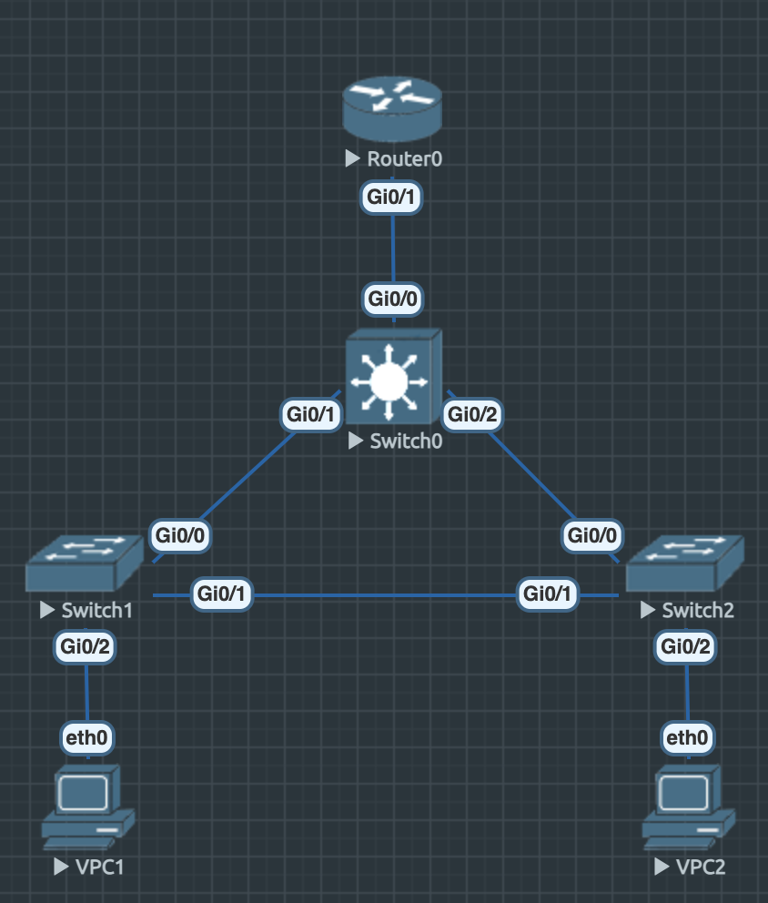
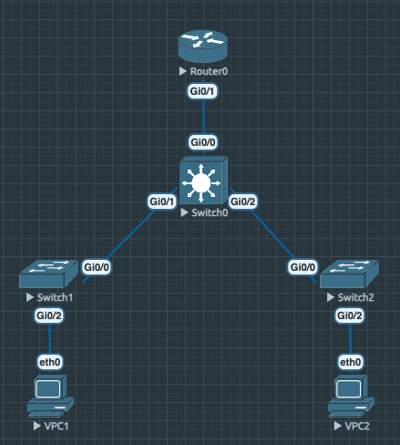
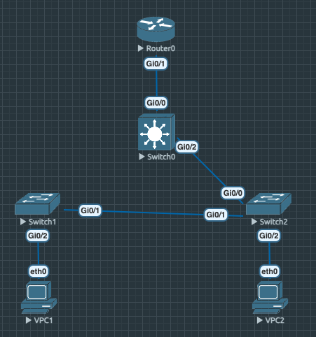
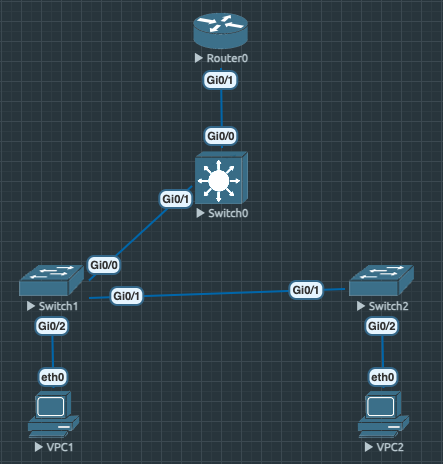

# Рализация небольшой сети офиса

## Топология
- Разместим и соеденим маршрутизатор, 3 коммутатора и 2 компьютера следующим образом:



## Настройка сети
- Включим все устройства и сконфигурируем следующим образом:

### VPC1
```shell
set pcname VPC1
ip 10.0.10.2/24 10.0.10.1
write
```

### VPC2
```shell
set pcname VPC2
ip 10.0.20.2/24 10.0.20.1
write
```

### Switch1
- Все также назначим новое имя; объявим два **vlan: 10, 20**; создадим сеть **vlan 10**, настроив линк с **VPC1**; настроим линки со **Switch0**, **Switch2**, дабы через них прокидывались vlan

```shell
enable
    configure terminal
        vlan 10
        vlan 20
            exit
        interface range gi 0/0-1
            switchport trunk encapsulation dot1q
            switchport mode trunk
            switchport trunk allowed vlan 10,20
            exit
        interface gi 0/2
            switchport mode access
            switchport access vlan 10
            exit
        exit
    copy running-config startup-config
```

### Switch2
- Все аналогично Switch1

```shell
enable
    configure terminal
        vlan 10
        vlan 20
            exit
        interface range gi 0/0-1
            switchport trunk encapsulation dot1q
            switchport mode trunk
            switchport trunk allowed vlan 10,20
            exit
        interface gi 0/2
            switchport mode access
            switchport access vlan 20
            exit
        exit
    copy running-config startup-config
```

### Switch0
- Все аналогично предыдущим, но вдобавок настроим линки с **Router0**, чтобы через него также прокидывались **vlan**, а также назначим узел корнем **STP** деревьев для **vlan 10, 20**

```shell
enable
    configure terminal
        vlan 10
        vlan 20
            exit
        interface range gi 0/0-2
            switchport trunk encapsulation dot1q
            switchport mode trunk
            switchport trunk allowed vlan 10,20
            exit
        spanning-tree vlan 10 root primary
        spanning-tree vlan 20 root primary
        exit
    copy running-config startup-config
```

### Router0
- Ну и настроим маршрутизатор, объявив два внутренних интерфеса для пар **<vlan, сеть>** соответсвено

```shell
enable
    configure terminal
        interface gi 0/1
        no shutdown

        interface gi 0/1.1
            encapsulation dot1q 10
            ip address 10.0.10.1 255.255.255.0
            exit
        interface gi 0/1.2
            encapsulation dot1q 20
            ip address 10.0.20.1 255.255.255.0
            exit
        exit
    copy running-config startup-config
```

## Spanning-Tree
- **VLAN 10 -> Switch0**
```shell
VLAN0010
Spanning tree enabled protocol ieee
Root ID    Priority    24586
            Address     5000.0002.0000
            This bridge is the root
            Hello Time   2 sec  Max Age 20 sec  Forward Delay 15 sec

Bridge ID  Priority    24586  (priority 24576 sys-id-ext 10)
            Address     5000.0002.0000
            Hello Time   2 sec  Max Age 20 sec  Forward Delay 15 sec
            Aging Time  300 sec

Interface           Role Sts Cost      Prio.Nbr Type
------------------- ---- --- --------- -------- --------------------------------
Gi0/0               Desg FWD 4         128.1    P2p 
Gi0/1               Desg FWD 4         128.2    P2p 
Gi0/2               Desg FWD 4         128.3    P2p
```

- **VLAN 20 -> Switch0**
```shell
VLAN0020
Spanning tree enabled protocol ieee
Root ID    Priority    24596
            Address     5000.0002.0000
            This bridge is the root
            Hello Time   2 sec  Max Age 20 sec  Forward Delay 15 sec

Bridge ID  Priority    24596  (priority 24576 sys-id-ext 20)
            Address     5000.0002.0000
            Hello Time   2 sec  Max Age 20 sec  Forward Delay 15 sec
            Aging Time  300 sec

Interface           Role Sts Cost      Prio.Nbr Type
------------------- ---- --- --------- -------- --------------------------------
Gi0/0               Desg FWD 4         128.1    P2p 
Gi0/1               Desg FWD 4         128.2    P2p 
Gi0/2               Desg FWD 4         128.3    P2p
```

- **VLAN 10 -> Switch1**
```shell
VLAN0010
Spanning tree enabled protocol ieee
Root ID    Priority    24586
            Address     5000.0002.0000
            Cost        4
            Port        1 (GigabitEthernet0/0)
            Hello Time   2 sec  Max Age 20 sec  Forward Delay 15 sec

Bridge ID  Priority    32778  (priority 32768 sys-id-ext 10)
            Address     5000.0003.0000
            Hello Time   2 sec  Max Age 20 sec  Forward Delay 15 sec
            Aging Time  300 sec

Interface           Role Sts Cost      Prio.Nbr Type
------------------- ---- --- --------- -------- --------------------------------
Gi0/0               Root FWD 4         128.1    P2p 
Gi0/1               Desg FWD 4         128.2    P2p 
Gi0/2               Desg FWD 4         128.3    P2p
```

- **VLAN 20 -> Switch1**
```shell
VLAN0020
Spanning tree enabled protocol ieee
Root ID    Priority    24596
            Address     5000.0002.0000
            Cost        4
            Port        1 (GigabitEthernet0/0)
            Hello Time   2 sec  Max Age 20 sec  Forward Delay 15 sec

Bridge ID  Priority    32788  (priority 32768 sys-id-ext 20)
            Address     5000.0003.0000
            Hello Time   2 sec  Max Age 20 sec  Forward Delay 15 sec
            Aging Time  300 sec

Interface           Role Sts Cost      Prio.Nbr Type
------------------- ---- --- --------- -------- --------------------------------
Gi0/0               Root FWD 4         128.1    P2p 
Gi0/1               Desg FWD 4         128.2    P2p
```

- **VLAN 10 -> Switch2**
```shell
VLAN0010
Spanning tree enabled protocol ieee
Root ID    Priority    24586
            Address     5000.0002.0000
            Cost        4
            Port        1 (GigabitEthernet0/0)
            Hello Time   2 sec  Max Age 20 sec  Forward Delay 15 sec

Bridge ID  Priority    32778  (priority 32768 sys-id-ext 10)
            Address     5000.0004.0000
            Hello Time   2 sec  Max Age 20 sec  Forward Delay 15 sec
            Aging Time  300 sec

Interface           Role Sts Cost      Prio.Nbr Type
------------------- ---- --- --------- -------- --------------------------------
Gi0/0               Root FWD 4         128.1    P2p 
Gi0/1               Altn BLK 4         128.2    P2p
```

- **VLAN 20 -> Switch2**
```shell
VLAN0020
Spanning tree enabled protocol ieee
Root ID    Priority    24596
            Address     5000.0002.0000
            Cost        4
            Port        1 (GigabitEthernet0/0)
            Hello Time   2 sec  Max Age 20 sec  Forward Delay 15 sec

Bridge ID  Priority    32788  (priority 32768 sys-id-ext 20)
            Address     5000.0004.0000
            Hello Time   2 sec  Max Age 20 sec  Forward Delay 15 sec
            Aging Time  300 sec

Interface           Role Sts Cost      Prio.Nbr Type
------------------- ---- --- --------- -------- --------------------------------
Gi0/0               Root FWD 4         128.1    P2p 
Gi0/1               Altn BLK 4         128.2    P2p 
Gi0/2               Desg FWD 4         128.3    P2p
```

### Ping
- **VPC1 -> VPC2**
```shell
VPC1> ping 10.0.20.2 -c 1

84 bytes from 10.0.20.2 icmp_seq=1 ttl=63 time=9.238 ms

VPC1> ping 10.0.20.1 -c 1

84 bytes from 10.0.20.1 icmp_seq=1 ttl=255 time=7.106 ms
```

- **VPC2 -> VPC1**
```shell
VPC1> ping 10.0.10.2 -c 1

84 bytes from 10.0.10.2 icmp_seq=1 ttl=63 time=13.647 ms

VPC1> ping 10.0.10.1 -c 1

84 bytes from 10.0.10.1 icmp_seq=1 ttl=255 time=8.583 ms
```

### Отказоустойчивость
- Проверим свзяность для **трех различных случаев** разрыва связи:




- **VPC1 -> VPC2**
```shell
VPC1> ping 10.0.20.2 -c 1

84 bytes from 10.0.20.2 icmp_seq=2 ttl=63 time=7.728 ms
```

- **VPC2 -> VPC1**
```shell
VPC2> ping 10.0.10.2 -c 1

84 bytes from 10.0.10.2 icmp_seq=3 ttl=63 time=5.674 ms
```



- **VPC1 -> VPC2**
```shell
VPC1> ping 10.0.20.2 -c 1

84 bytes from 10.0.20.2 icmp_seq=2 ttl=63 time=9.492 ms
```

- **VPC2 -> VPC1**
```shell
VPC2> ping 10.0.10.2 -c 1

84 bytes from 10.0.10.2 icmp_seq=1 ttl=63 time=9.257 ms
```




- **VPC1 -> VPC2**
```shell
VPC1> ping 10.0.20.2 -c 1

84 bytes from 10.0.20.2 icmp_seq=3 ttl=63 time=10.769 ms
```

- **VPC2 -> VPC1**
```shell
VPC2> ping 10.0.10.2 -c 1

84 bytes from 10.0.10.2 icmp_seq=1 ttl=63 time=9.104 ms
```

### Все конфиги находятся в папке "configs"